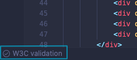

# Web Validator

> Web validator let you check the validity of any HTML file with the W3C Validator API.

## Stay up to standard all the time.
### Start the validation
>
### Detect errors
>
### Correct your errors
>

> Author : Riboulet Célian
